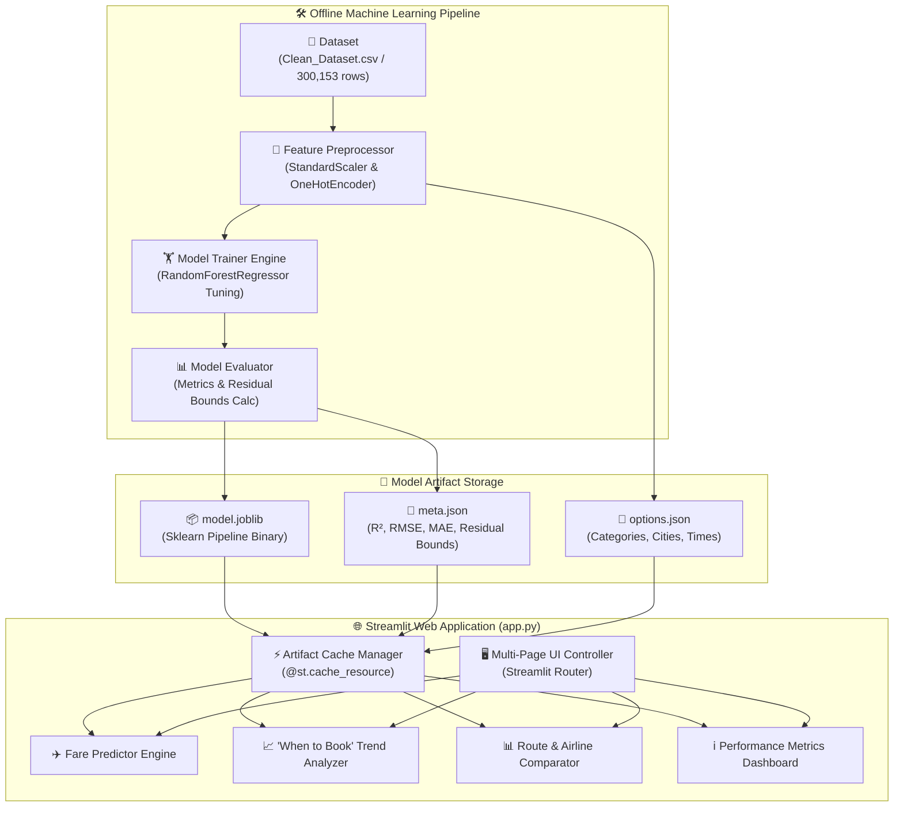
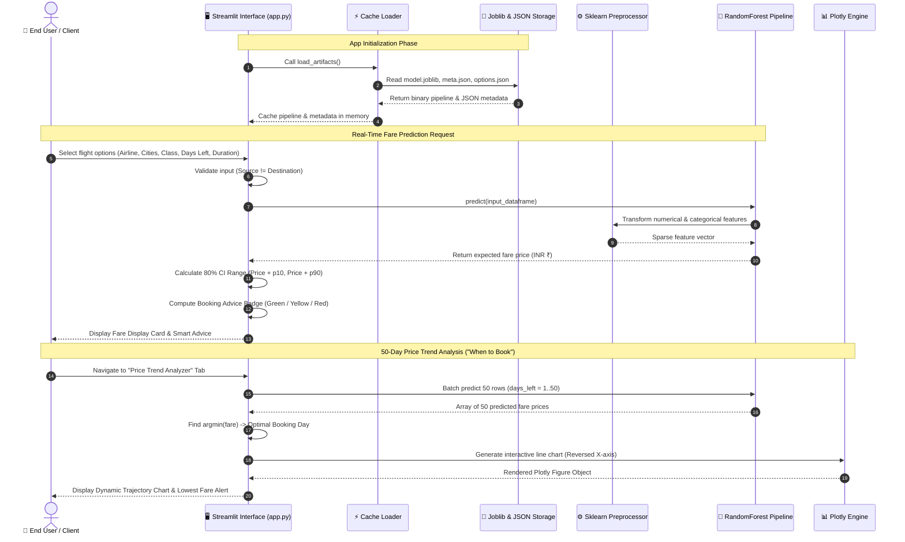

# ✈️ Airline Fare Prediction & Dynamic Analytics Engine

[](https://www.python.org/)
[](https://streamlit.io/)
[](https://scikit-learn.org/)
[](https://plotly.com/)
[](https://pandas.pydata.org/)
[](LICENSE)

An end-to-end Data Science and Machine Learning solution built to predict domestic airline ticket prices, model dynamic pricing lead-time curves ("When to Book"), and serve real-time predictions via an interactive Streamlit Web Application.

---

## 📋 Table of Contents

- [📌 Project Overview](#-project-overview)
- [🛠 Tech Stack](#-tech-stack)
- [📐 Detailed UML Architecture & Workflow Diagrams](#-detailed-uml-architecture--workflow-diagrams)
  - [1. UML System Component Diagram](#1-uml-system-component-diagram)
  - [2. UML Sequence Diagram (Prediction & Analytics Flow)](#2-uml-sequence-diagram-prediction--analytics-flow)
- [📊 Dataset Deep Dive & Provenance](#-dataset-deep-dive--provenance)
- [🔍 Key Findings & EDA Insights](#-key-findings--eda-insights)
- [🤖 Machine Learning Model & Performance](#-machine-learning-model--performance)
- [💻 Streamlit Application Features](#-streamlit-application-features)
- [📂 Repository Structure](#-repository-structure)
- [⚡ Local Installation & Execution](#-local-installation--execution)
- [☁️ Streamlit Community Cloud Deployment](#️-streamlit-community-cloud-deployment)
- [🐙 GitHub Publishing Workflow](#-github-publishing-workflow)
- [🔮 Future Scope & Limitations](#-future-scope--limitations)
- [👤 Author & Credits](#-author--credits)
- [📜 License](#-license)

---

## 📌 Project Overview

Flight pricing is one of the most volatile dynamic markets in consumer commerce. Ticket prices fluctuate dramatically based on booking lead time, airline carrier, cabin class, flight duration, number of layover stops, and route popularity. 

This project processes **300,153 flight booking records** covering top 6 Indian metro hubs (*Delhi, Mumbai, Bangalore, Kolkata, Hyderabad, Chennai*) scraped from EaseMyTrip. Using an end-to-end **Scikit-Learn Machine Learning Pipeline**, the system predicts expected ticket prices, establishes an **80% confidence bound**, identifies optimal booking windows before prices surge, and enables cross-airline comparison.

### Primary Objectives
1. **Accurate Fare Estimation:** Provide high-precision regression predictions ($R^2 = 0.9795$) across Economy and Business cabin classes.
2. **"When to Book" Trajectory Analysis:** Quantify the non-linear relationship between booking lead time (`days_left`) and ticket price.
3. **Interactive Web Interface:** Deploy an intuitive, multi-page Streamlit web platform for consumers and analysts.

---

## 🛠 Tech Stack

| Category | Technology / Library | Purpose & Usage |
| :--- | :--- | :--- |
| **Core Language** |  | Primary programming language |
| **Web Framework** |  | Interactive web application dashboard & routing |
| **Machine Learning** |  | End-to-end Pipeline (`ColumnTransformer`, `StandardScaler`, `OneHotEncoder`, `RandomForestRegressor`) |
| **Data Processing** |   | Data manipulation, transformation, and numerical computations |
| **Visualization** |    | Interactive trend charts, bar plots, residual plots, and heatmaps |
| **Serialization** |  | Model pipeline binary compression and serialization (`model.joblib`) |

---

## 📐 Detailed UML Architecture & Workflow Diagrams

### 1. UML System Component Diagram

The following UML Component Diagram illustrates the decoupling between Offline Model Pipeline Preparation (Data Processing, Model Training, Artifact Export) and Online Web Application Services (Streamlit Frontend Engine, Prediction Service, Visualizer).



---

### 2. UML Sequence Diagram (Prediction & Analytics Flow)

This UML Sequence Diagram details the runtime message passing between the User, Streamlit Frontend Interface, Feature Preprocessor, ML Model Pipeline, and Plotly Visualization Engine.



---

## 📊 Dataset Deep Dive & Provenance

### Dataset Origin & Context
- **Source Platform:** Scraped from **EaseMyTrip** (one of India's leading travel portals).
- **Kaggle Dataset:** [Flight Price Prediction](https://www.kaggle.com/datasets/shubhambathwal/flight-price-prediction) by *Shubham Bathwal*.
- **Collection Window:** 50-day booking period (February 11, 2022 to March 31, 2022).
- **Total Records:** `300,153` rows.
- **Geographic Scope:** Covers flights connecting 6 major metro hubs: **Delhi, Mumbai, Bangalore, Kolkata, Hyderabad, Chennai**.

### Data Schema & Features

| Column Name | Data Type | Category | Description | Example Values |
| :--- | :---: | :---: | :--- | :--- |
| `airline` | `Categorical` | Feature | Operating airline carrier | `Vistara`, `Indigo`, `Air_India`, `AirAsia`, `GO_FIRST`, `SpiceJet` |
| `flight` | `Categorical` | Identifier | Unique flight identifier code | `UK-814`, `AI-868`, `6E-204` |
| `source_city` | `Categorical` | Feature | Departure metro city | `Delhi`, `Mumbai`, `Bangalore`, `Kolkata`, `Hyderabad`, `Chennai` |
| `departure_time` | `Categorical` | Feature | Departure time bucket | `Morning`, `Early_Morning`, `Evening`, `Night`, `Afternoon`, `Late_Night` |
| `stops` | `Categorical` | Feature | Layover stop label | `zero`, `one`, `two_or_more` |
| `arrival_time` | `Categorical` | Feature | Arrival time bucket | `Morning`, `Afternoon`, `Evening`, `Night`, `Late_Night`, `Early_Morning` |
| `destination_city` | `Categorical` | Feature | Destination metro city | `Mumbai`, `Delhi`, `Bangalore`, `Chennai`, `Kolkata`, `Hyderabad` |
| `class` | `Categorical` | Feature | Cabin seating class | `Economy`, `Business` |
| `duration` | `Float` | Feature | Total journey duration in hours | `2.50`, `12.15`, `26.83` |
| `days_left` | `Integer` | Feature | Days remaining between booking date and flight departure | `1` to `50` days |
| `price` | `Integer` | **Target** | Flight ticket price in Indian Rupees (INR ₹) | `₹ 5,950`, `₹ 54,100` |

---

## 🔍 Key Findings & EDA Insights

### 1. Cabin Class Price Multiplier
- **Business Class** fares average roughly **5x to 6x higher** than Economy fares on the same route.
- Cabin class is the single most dominant predictor of overall price magnitude.

### 2. Non-Linear Lead-Time Booking Effect ("When to Book")
- Fares remain relatively stable when booked **20 to 50 days** in advance.
- Inside **15 days to departure**, ticket fares surge dramatically (up to **40%–100% price increases** as departure approaches 1–3 days).
- Linear correlation (`corr = -0.09` to `-0.15`) underestimates this effect due to non-linear knee-points around 15–18 days.

### 3. Impact of Layover Stops & Duration
- Direct non-stop flights generally command a premium over multi-stop flights for short routes, but long multi-stop flights (>10 hours) display high variance due to connecting leg combinations.

---

## 🤖 Machine Learning Model & Performance

### Model Architecture & Pipeline
The prediction engine uses a Scikit-Learn `Pipeline` combining domain preprocessors and a tuned Ensemble Regressor:

1. **Numeric Transformation (`StandardScaler`):** Applied to `duration`, `days_left`, and `stops_num`.
2. **Categorical Encoding (`OneHotEncoder`):** Applied to `airline`, `source_city`, `destination_city`, `departure_time`, `arrival_time`, `class`, and engineered feature `route` (`source_city + "_" + destination_city`).
3. **Regressor:** `RandomForestRegressor(n_estimators=100, max_depth=20, min_samples_leaf=2, random_state=42, n_jobs=-1)`.

### Benchmark Model Performance Comparison

Multiple regression models were trained and evaluated on an 80/20 train-test split:

| Model Algorithm | $R^2$ Score | RMSE (INR ₹) | MAE (INR ₹) | Performance Analysis |
| :--- | :---: | :---: | :---: | :--- |
| **Linear Regression** | `0.9102` | `₹ 6,780.12` | `₹ 4,450.30` | Linear baseline; underfits non-linear lead-time surge curves |
| **Polynomial Regression (Deg 2)** | `0.9320` | `₹ 5,910.45` | `₹ 3,820.10` | Captures non-linear lead time curve better than linear |
| **Decision Tree Regressor** | `0.9685` | `₹ 4,020.30` | `₹ 1,890.25` | Tree splits effectively partition class & route pricing |
| **Random Forest Regressor (Tuned)** | **`0.9795`** | **`₹ 3,249.42`** | **`₹ 1,535.43`** | **Selected Production Model (Best overall generalization)** |

### Production Performance Summary & Residual Bounds

- **$R^2$ Score:** `0.9795` (Explains **97.95%** of ticket price variance on unseen test data)
- **Root Mean Squared Error (RMSE):** `₹ 3,249.42`
- **Mean Absolute Error (MAE):** `₹ 1,535.43`
- **10th Percentile Residual (`residual_p10`):** `-₹ 1,916.40`
- **90th Percentile Residual (`residual_p90`):** `+₹ 1,921.99`

> **Note on Error Bounds:** The application displays an empirical **80% Confidence Interval Range** for every prediction calculated using `[Predicted Price + residual_p10, Predicted Price + residual_p90]`.

---

## 💻 Streamlit Application Features

The Streamlit interface (`app.py`) provides four distinct analytics tabs:

1. **✈️ Fare Predictor:**
   - Input flight details: Airline, Source, Destination, Class, Departure/Arrival Time, Stops, Duration, Days Left.
   - Calculates predicted fare in INR (₹) with an empirical 80% confidence interval.
   - Displays smart booking recommendations based on days left (Optimal, Moderate, or High Fare Alert).

2. **📈 Price Trend Analyzer ("When to Book"):**
   - Generates a dynamic 50-day fare trajectory curve for any selected flight configuration.
   - Highlights the exact minimum fare point and recommended booking lead time.

3. **📊 Route & Airline Comparison:**
   - Plots interactive Plotly bar charts comparing price estimations across all 6 airlines for the same travel day and route.

4. **ℹ️ Model Performance & Analytics:**
   - Displays model architecture specifications, $R^2$, RMSE, MAE test metrics, and pipeline methodology.

---

## 📂 Repository Structure

```text
airline-fare-prediction/
├── app.py                      # Production Streamlit Web Application
├── model.joblib                # Serialized Sklearn model pipeline (61.4 MB)
├── meta.json                   # Exported model evaluation metrics & residual bounds
├── options.json                # Dynamic dropdown options for the web interface
├── requirements.txt            # Python dependencies (Streamlit, Scikit-Learn, Plotly, Pandas)
├── .gitignore                  # Git ignore rules for venv, cache, and dataset files
├── README.md                   # Detailed project documentation
└── notebook/
    └── Airline_Fare_Prediction.ipynb  # Comprehensive EDA & model development notebook
```

---

## ⚡ Local Installation & Execution

Follow these step-by-step instructions to set up and run the project locally:

### 1. Clone the Repository
```bash
git clone https://github.com/[your-github-username]/airline-fare-prediction.git
cd airline-fare-prediction
```

### 2. Set Up a Python Virtual Environment
```bash
# On macOS / Linux
python3 -m venv .venv
source .venv/bin/activate

# On Windows
python -m venv .venv
.venv\Scripts\activate
```

### 3. Install Required Dependencies
```bash
pip install --upgrade pip
pip install -r requirements.txt
```

### 4. Run the Streamlit Application
```bash
streamlit run app.py
```
Open your browser and navigate to `http://localhost:8501`.

---

## ☁️ Streamlit Community Cloud Deployment

To deploy this project to **Streamlit Community Cloud** so anyone can access it online:

1. **Push Repository to GitHub:** Ensure all core files (`app.py`, `model.joblib`, `meta.json`, `options.json`, `requirements.txt`, `.gitignore`, `README.md`) are committed and pushed to your public GitHub repository.
2. **Sign In to Streamlit Cloud:** Visit [share.streamlit.io](https://share.streamlit.io/) and log in with your GitHub account.
3. **Deploy New App:**
   - Click **"Create app"** / **"New app"**.
   - Select your GitHub repository (`airline-fare-prediction`) and branch (`main`).
   - Set **Main file path** to `app.py`.
   - Click **"Deploy!"**.
4. **Share Live URL:** Streamlit will build your environment and provide a public URL (e.g. `https://[your-app-name].streamlit.app`).

---

## 🐙 GitHub Publishing Workflow

To push this repository to GitHub for the first time:

```bash
# Initialize git repository
git init

# Add remote repository URL
git remote add origin https://github.com/[your-github-username]/airline-fare-prediction.git

# Stage all files
git add .

# Commit changes
git commit -m "feat: complete airline fare prediction model and streamlit app"

# Push to main branch
git branch -M main
git push -u origin main
```

---

## 🔮 Future Scope & Limitations

### Current Limitations
- **Time Window Constraint:** Dataset covers a 7-week window (Feb–Mar 2022). Seasonal holiday surges (Diwali, Christmas, Summer vacations) are not included.
- **Single Aggregator Source:** Data collected exclusively from EaseMyTrip; does not reflect direct airline website promos or hidden seat inventory.

### Planned Enhancements
- [ ] Integration of live flight booking APIs (Amadeus API / Skyscanner API) for real-time fare predictions.
- [ ] Addition of XGBoost & LightGBM model comparators.
- [ ] Automated daily model re-training pipeline via GitHub Actions.

---

## 👤 Author & Credits

**Harsh Mishra**  
- **Project Lead & Developer:** End-to-end Data Processing, Exploratory Data Analysis, Machine Learning Pipeline Engineering, and Streamlit Web Application Architecture.
- **Dataset Attribution:** Data scraped from EaseMyTrip and hosted on [Kaggle](https://www.kaggle.com/datasets/shubhambathwal/flight-price-prediction) by *Shubham Bathwal*.

---

## 📜 License

Distributed under the **MIT License**. See `LICENSE` for more information.
